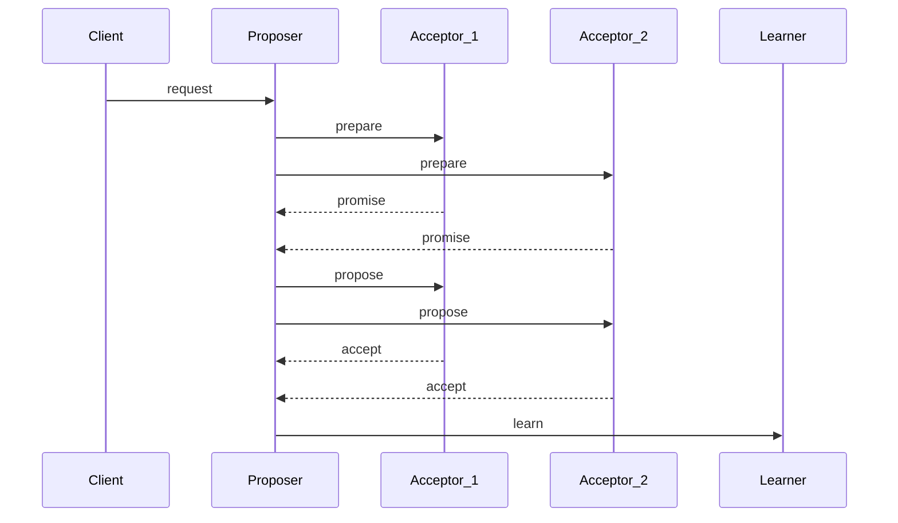

### Sequence Diagram

### API
- **/proposer/request**: {value: string}
proposer will call the following api
 1. /acceptor/prepare
 2. /acceptor/propose

- **/acceptor/prepare**: {number: int}
prepare number must be higher than highest promise number

- **/acceptor/propose**: {number: int}
propose number must be higher than highest accept proposal number

- **/learner/accept**: {number: int, value: string}
number must be higher than accepted number

- **/learner/retrieve**: {number: int}
to retrieved the learned values

### Consensus
minimum votes: N/2 + 1 where N is total number of nodes