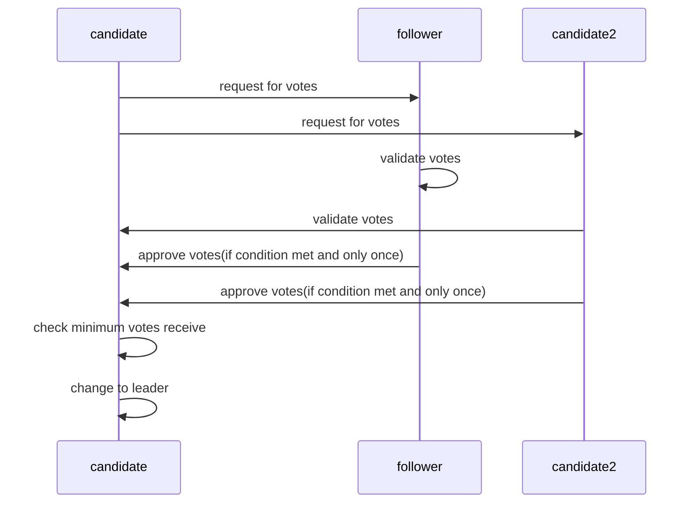
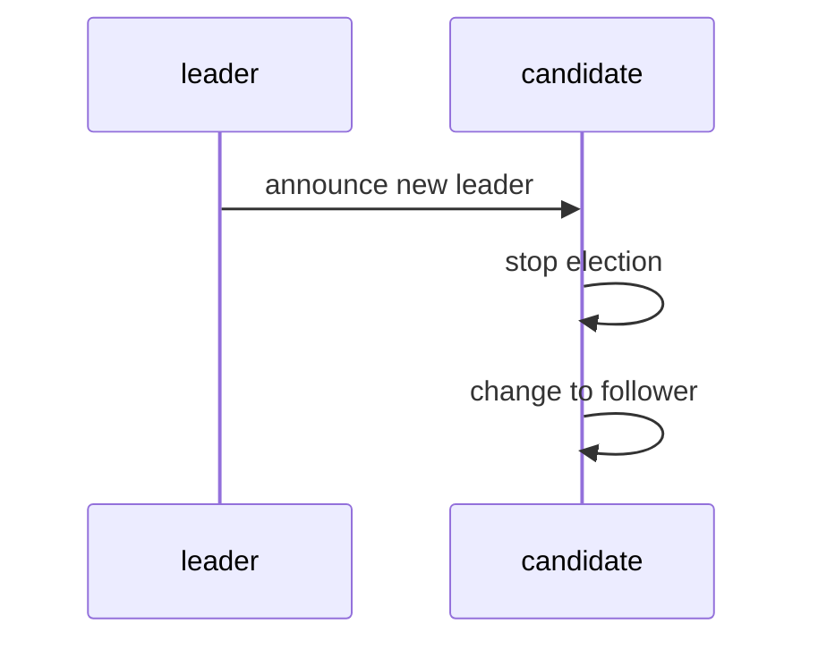
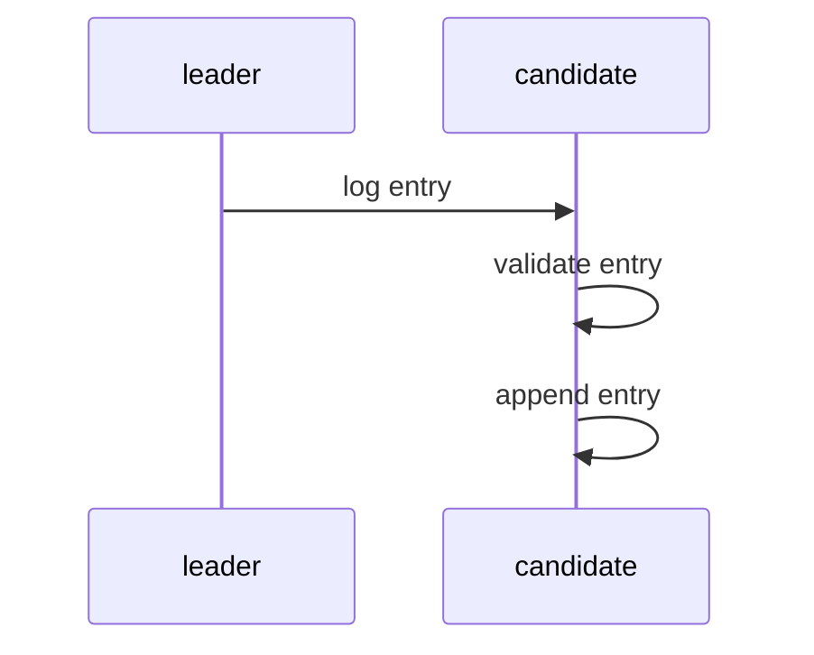

Request for votes

```mermaid
sequenceDiagram
    candidate->>follower: request for votes
    candidate->>candidate2: request for votes
    follower->>follower: validate votes
    candidate2->>candidate: validate votes
    follower->>candidate: approve votes(if condition met and only once)
    candidate2->>candidate: approve votes(if condition met and only once)
    candidate->>candidate: check minimum votes receive
    candidate->>candidate: change to leader
```

New Leader Announcement

```mermaid
sequenceDiagram
    leader ->> candidate: announce new leader
    candidate ->> candidate: stop election
    candidate ->> candidate: change to follower
```

Append Log Entry

```mermaid
sequenceDiagram
    leader ->> candidate: log entry
    candidate ->> candidate: validate entry
    candidate ->> candidate: append entry
```