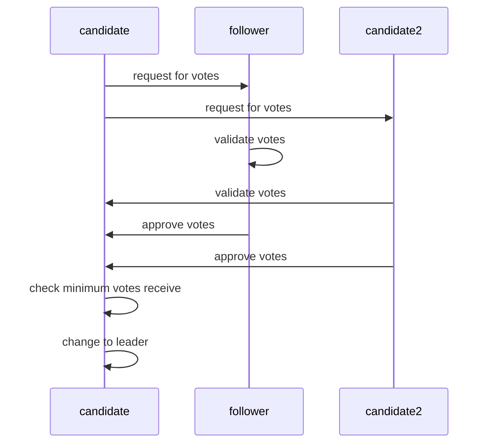
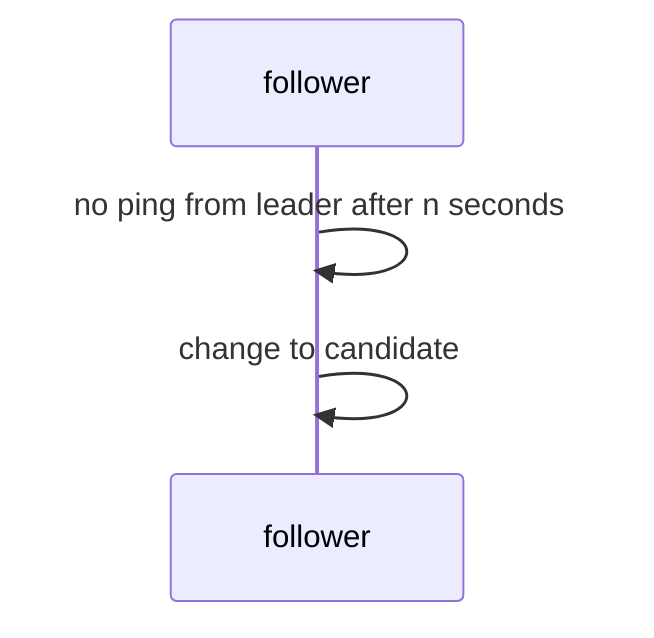
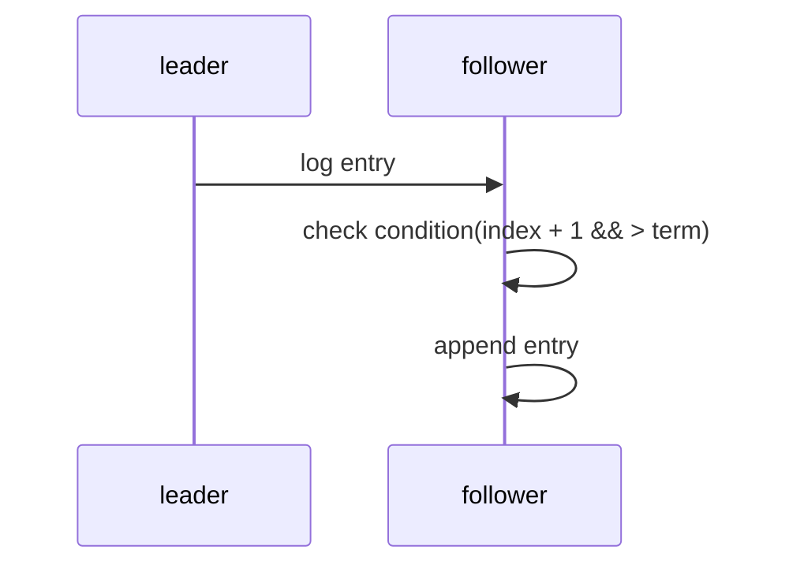
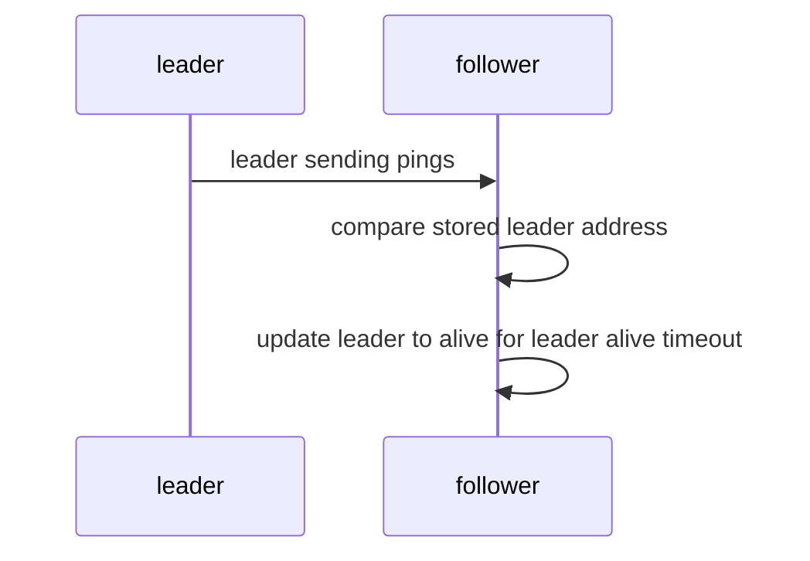
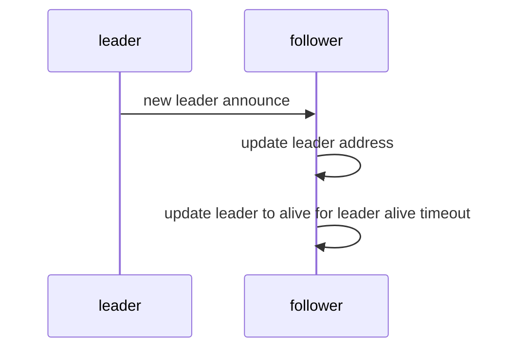

Vote Request

```mermaid
sequenceDiagram
    candidate->>follower: request for votes
    candidate->>candidate2: request for votes
    follower->>follower: validate votes
    candidate2->>candidate: validate votes
    follower->>candidate: approve votes
    candidate2->>candidate: approve votes
    candidate->>candidate: check minimum votes receive
    candidate->>candidate: change to leader
```

Leader Timeout

```mermaid
sequenceDiagram
    follower->>follower: no ping from leader after n seconds
    follower->>follower: change to candidate
```

Append Log Entries

```mermaid
sequenceDiagram
    leader->>follower: log entry
    follower->>follower: check condition(index + 1 && > term)
    follower->>follower: append entry
```

Leader Health Check

```mermaid
sequenceDiagram
    leader->>follower: leader sending pings
    follower->>follower: compare stored leader address
    follower->>follower: update leader to alive for leader alive timeout
```

New Leader Annoucement

```mermaid
sequenceDiagram
leader->>follower: new leader announce
follower->>follower: update leader address
follower->>follower: update leader to alive for leader alive timeout
```

